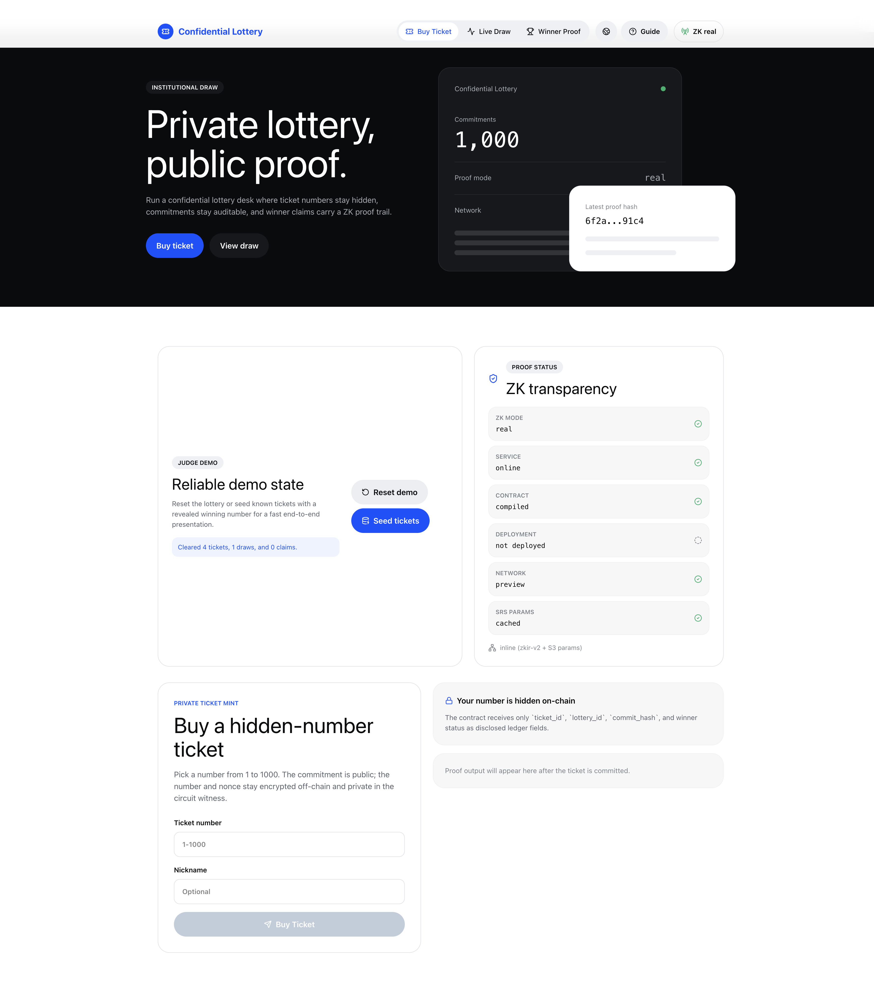
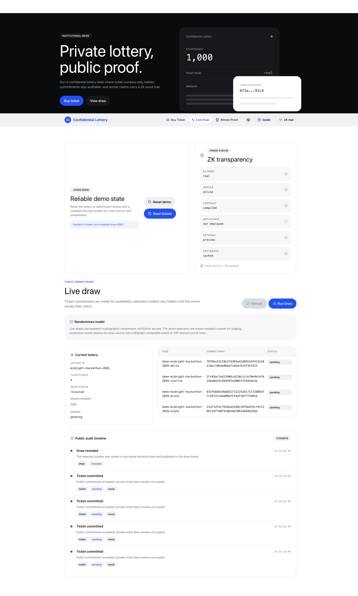
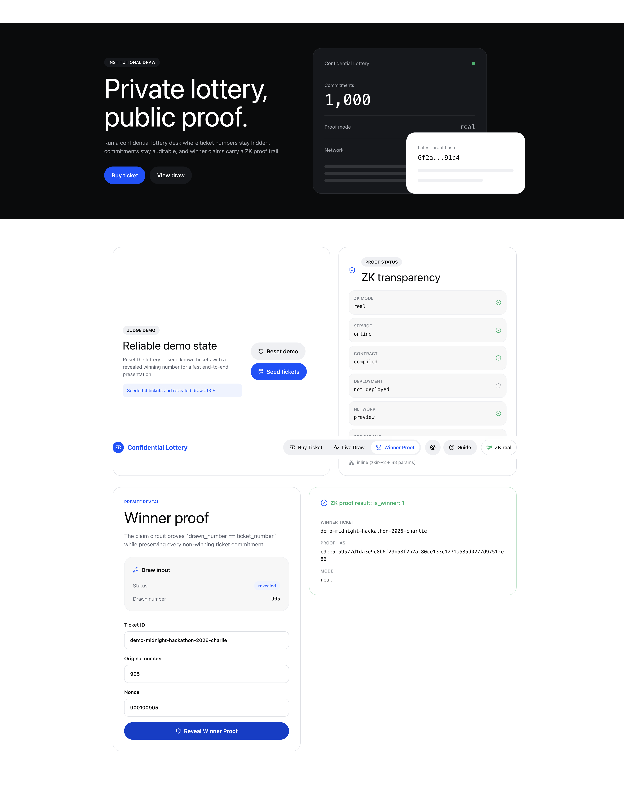
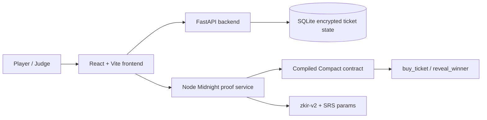

# Confidential Lottery

Privacy-preserving lottery prototype for Midnight: private ticket numbers, public commitments, and winner claims backed by a ZK proof trail.

Confidential Lottery demonstrates a full judge-ready flow for running a lottery where players do not reveal their selected numbers unless they win. The public can audit commitments, draws, and accepted claims, while the private ticket number and nonce stay encrypted off-chain and private inside the proof witness.



## What It Does

- Lets a player buy a hidden-number ticket from `1` to `1000`.
- Publishes only `ticket_id`, `lottery_id`, `commit_hash`, proof hash, ZK mode, and status.
- Encrypts the ticket number, nonce, and nickname in the FastAPI backend before SQLite persistence.
- Runs a separate Node service for Midnight's Node-only proof tooling.
- Uses a Compact contract with `buy_ticket` and `reveal_winner` circuits.
- Shows proof transparency in the UI: real vs mock mode, contract compilation, network, deployment, and SRS parameter status.
- Includes judge demo controls that reset and seed a deterministic winning round.
- Provides a public audit timeline for ticket commitments, draw reveals, and winner proof acceptance.

## Screenshots

### Live Draw And Audit Trail



### Winner Proof



## Why Midnight

Lottery systems need public confidence without exposing every participant's private pick. Midnight's Compact language and ZK tooling are a natural fit for this shape of workflow:

| Workflow step | Public output | Private witness |
| --- | --- | --- |
| Buy ticket | Ticket ID, lottery ID, commitment hash, pending winner status | Ticket number, nonce |
| Reveal winner | Winner ticket ID, winner status, proof hash | Drawn number, ticket number, nonce |

The current prototype can run real local proof generation when the Compact build artifacts and SRS params are available. When the local environment cannot prove, the app falls back to mock mode and makes that explicit in the UI.

## Architecture



## Tech Stack

- Frontend: React, Vite, Tailwind CSS, lucide-react
- Backend: FastAPI, SQLite, Fernet encryption
- Midnight bridge: Node.js, Express, Compact runtime, Midnight ledger WASM, `zkir-v2`
- Contract: Compact source at `contract/src/lottery.compact`
- Demo/runtime ports: frontend `3006`, backend `8006`, Midnight service `3007`

## Quick Start

### Prerequisites

- Node.js 20+
- Python 3.10+
- npm
- Optional for real local proofs: Midnight Compact CLI and reachable/cached SRS params

### Install

```sh
npm run install:all
```

### Run The App

```sh
npm start
```

Then open:

```text
http://localhost:3006
```

The startup script launches all three services:

- Frontend: `http://localhost:3006`
- Backend API: `http://localhost:8006`
- Midnight proof service: `http://localhost:3007`

If the Compact CLI is available, `start.sh` compiles `contract/src/lottery.compact` into `contract/dist/lottery`. If not, the app still runs in explicit mock fallback mode.

## Judge Demo Flow

1. Run `npm start`.
2. Open `http://localhost:3006`.
3. Click `Reset demo`.
4. Click `Seed tickets`.
5. Open `Live Draw` to inspect commitments, revealed draw `905`, and the public audit timeline.
6. Open `Winner Proof` and submit the prefilled claim.

Seeded winning values:

```text
Ticket ID: demo-midnight-hackathon-2026-charlie
Ticket number: 905
Nonce: 900100905
Drawn number: 905
```

## Contract Model

The Compact contract keeps the public ledger intentionally small:

```compact
export ledger ticket_id:   Opaque<"string">;
export ledger lottery_id:  Opaque<"string">;
export ledger commit_hash: Opaque<"string">;
export ledger is_winner:   Uint<32>;
```

Implemented circuits:

- `buy_ticket`: proves the private ticket number is within `1..1000`, then discloses ticket ID, lottery ID, commitment hash, and pending winner status.
- `reveal_winner`: proves `drawn_number == ticket_number`, then discloses the winner ticket ID and winner status.

## Environment

Defaults are already set for local demo mode. See `.env.example` for configurable values:

```text
VITE_MIDNIGHT_SERVICE_URL=http://localhost:3007
VITE_API_BASE_URL=
VITE_LOTTERY_ID=midnight-hackathon-2026
LOTTERY_ID=midnight-hackathon-2026
CORS_ORIGINS=http://localhost:3006,http://127.0.0.1:3006,http://localhost:5173,http://127.0.0.1:5173
PORT=3007
MIDNIGHT_ENV=preview
PROOF_SERVER_URL=http://localhost:6301
CONTRACT_ADDRESS=
```

The backend generates and stores `LOTTERY_ENCRYPTION_KEY` in `backend/.env` on first run if one is not provided. Local env files, SQLite databases, virtualenvs, node modules, build outputs, and generated contract artifacts are ignored by Git.

## Honest Prototype Status

- Local proof generation is supported through the Midnight service when compiled artifacts and SRS params are available.
- The demo has not been deployed to a live Midnight contract by default. Set `CONTRACT_ADDRESS` or provide `contract/deployed-address.json` after deployment.
- Live draws currently use Python's `secrets` module. The seeded demo pins draw `905` for reliable judging.
- A production draw should use a verifiable randomness source such as an oracle, VRF, or Midnight-compatible draw input.
- Non-winning tickets never need to reveal their selected numbers in the app flow.

## Project Structure

```text
backend/            FastAPI API, encrypted ticket storage, draws, claims
contract/src/       Compact lottery contract
frontend/           React/Vite user interface
midnight-service/   Node bridge for Midnight proof tooling
media/screenshots/  README screenshots
media/thumbnails/   Submission thumbnail assets
DEMO_SCRIPT.md      4-6 minute and 90-second recording scripts
```

## Demo Script

For a polished submission video, use `DEMO_SCRIPT.md`. It includes the long-form judge walkthrough, a 90-second version, known seed values, and technical talking points.