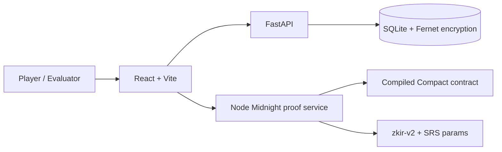

# Confidential Lottery

Official hackathon submission for a privacy-preserving lottery workflow on Midnight.

Confidential Lottery lets players enter a lottery without exposing their selected ticket number to the public. Each ticket becomes a public commitment, each draw is auditable, and only the winner reveals the proof needed to claim. The result is a lottery experience where public verification and participant privacy coexist in the same workflow.


## Submission Summary

Confidential Lottery demonstrates a practical use case for Midnight's privacy and ZK capabilities: a lottery desk where hidden inputs remain private while outcomes stay publicly verifiable.

The application includes three core flows:

- Private ticket purchase: the player chooses a number from `1` to `1000`, and the app publishes only a commitment.
- Public draw board: commitments, draw state, and audit events are visible without exposing ticket numbers.
- Winner proof: the winner proves that their hidden number matches the drawn number.

## Event Screens

### Public Draw And Audit Trail


### Winner Proof Result


## Midnight Integration

The Compact contract models the lottery with a small public ledger and private witness inputs.

| Circuit | Public result | Private witness |
| --- | --- | --- |
| `buy_ticket` | Ticket ID, lottery ID, commitment hash, pending winner status | Ticket number, nonce |
| `reveal_winner` | Winner ticket ID, winner status | Drawn number, ticket number, nonce |

Public ledger fields:

```compact
export ledger ticket_id:   Opaque<"string">;
export ledger lottery_id:  Opaque<"string">;
export ledger commit_hash: Opaque<"string">;
export ledger is_winner:   Uint<32>;
```

The proof bridge loads the compiled Compact contract, Compact runtime, Midnight ledger WASM module, and `zkir-v2` proof tooling. When local prover material and SRS params are available, the app runs the real local proof path. If the proof environment is unavailable, the UI clearly reports mock fallback mode instead of hiding it.

## Product Experience

- Hidden-number ticket minting with receipt export.
- Public commitment board for auditability.
- Proof transparency panel showing ZK mode, contract compilation, network, deployment, and SRS status.
- Encrypted backend storage for ticket number, nonce, and optional nickname.
- Winner claim flow that verifies private ticket data against the commitment and current draw.
- Evaluation mode with deterministic seeding for a reliable end-to-end event review.

## Architecture



## Technical Build

- Frontend: React, Vite, Tailwind CSS, lucide-react
- Backend: FastAPI, SQLite, Fernet encryption
- Proof service: Node.js, Express, Compact runtime, Midnight ledger WASM, `zkir-v2`
- Contract: Compact source in `contract/src/lottery.compact`
- Network target: Midnight `preview`

## Evaluation

The local evaluation build runs the frontend, backend, and Midnight proof service together:

```sh
npm run install:all
npm start
```

Open the app at:

```text
http://localhost:3006
```

For a deterministic end-to-end review, the app can seed a round with four committed tickets and a revealed winning draw of `905`. The seeded winner claim proves the relation `drawn_number == ticket_number` and records the accepted winner proof in the public audit timeline.

## Prototype Transparency

- Local proof generation is supported when Compact artifacts and SRS params are available.
- The default repository state is not a live deployed Midnight contract; deployment can be connected with `CONTRACT_ADDRESS` or `contract/deployed-address.json`.
- Live draws currently use backend cryptographic randomness through Python's `secrets` module.
- Production randomness should be replaced with a verifiable source such as an oracle, VRF, or Midnight-compatible draw input.
- Non-winning tickets do not reveal their selected numbers during the claim flow.

## Next Steps

- Deploy the Compact contract to a Midnight environment.
- Replace local draw randomness with verifiable randomness.
- Add wallet-connected identities and on-chain settlement.
- Expand the audit panel with deployed transaction references.